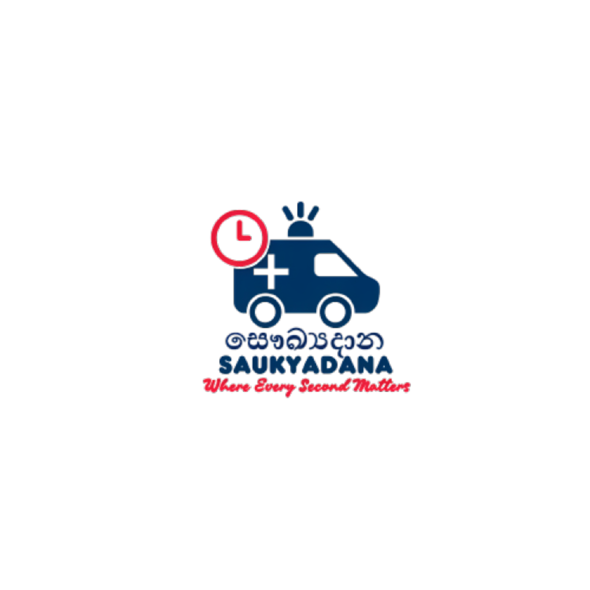

# 🩺 සෞඛ්‍යදාන (SAUKYADANA) - Web-Based Advance Emergency Ambulance Hiring Portal  

<p align="center">
  
</p>

A **web-based emergency ambulance hiring portal** designed to provide **fast, secure, and user-friendly access** to ambulance services in Sri Lanka.  
SAUKYADANA allows users to **book ambulances without registration**, track them in real-time, and communicate efficiently with medical service providers.

---

## 🚀 Features

- **Emergency Booking Without Account**: Users can request an ambulance using **ID, phone number, or name**.  
- **Real-Time Ambulance Tracking**: Track ambulance status and progress live.  
- **Live Chat & Chatbot Support**: Instant assistance for users’ queries.  
- **Admin Dashboard**: Manage bookings, track ambulances, generate reports.  
- **Secure & Privacy-Focused**: All user data is encrypted and securely handled.  
- **Responsive UI**: Works seamlessly on **desktop, tablet, and mobile devices**.  

---

## 🖼️ User Interfaces (Screenshots)

### 🏠 Home Page  
  
  

### 🚑 Hire an Ambulance  
  

### 📍 Ambulance Tracking  
  
  

### 📊 Admin Dashboard  
  

### 💬 Communication  
- **Live Chat Signup**  
    

- **Chatbox (User List)**  
    

- **Chat View**  
    

- **Chatbot Assistant**  
    

---

## 🛠️ Tech Stack

| Frontend | Backend | Database | Other |
|----------|---------|----------|-------|
| HTML5, CSS3, JavaScript, Bootstrap/Tailwind | PHP | MySQL | Live Chat, Email Gateway, SLF4J Logging |

---

## 📂 System Components

### User Roles
- **Administrator**
  - Manage ambulance bookings  
  - Handle live chat and chatbot responses  
  - Update web content and generate reports  
- **Booking Person / In-Charge**
  - Make ambulance bookings  
  - Track ambulance location  

### Functionalities
- Ambulance booking & management  
- Real-time tracking  
- Live chat + Chatbot assistance  
- Report generation & notifications  

### Non-Functional Requirements
- **Performance**: Low-latency ambulance tracking  
- **Security**: Data encryption + secure admin login  
- **Accessibility**: Mobile-friendly design for rural areas  

---

## 📈 System Architecture

```text
User -> Web Portal -> Admin Dashboard -> Ambulance Tracking API -> Database
