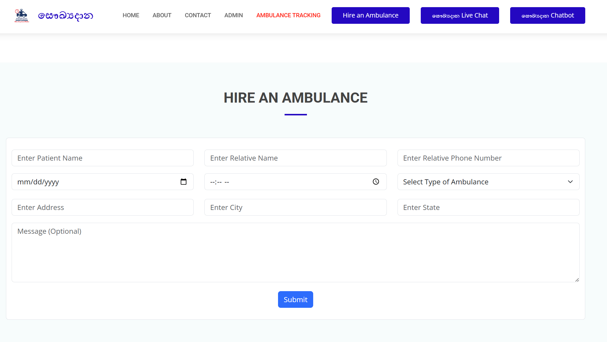
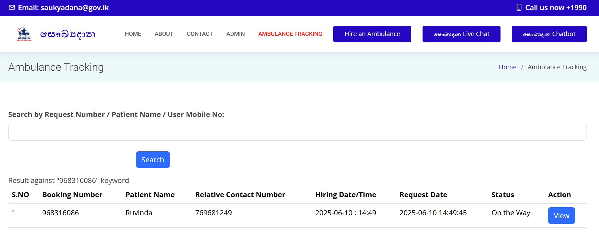
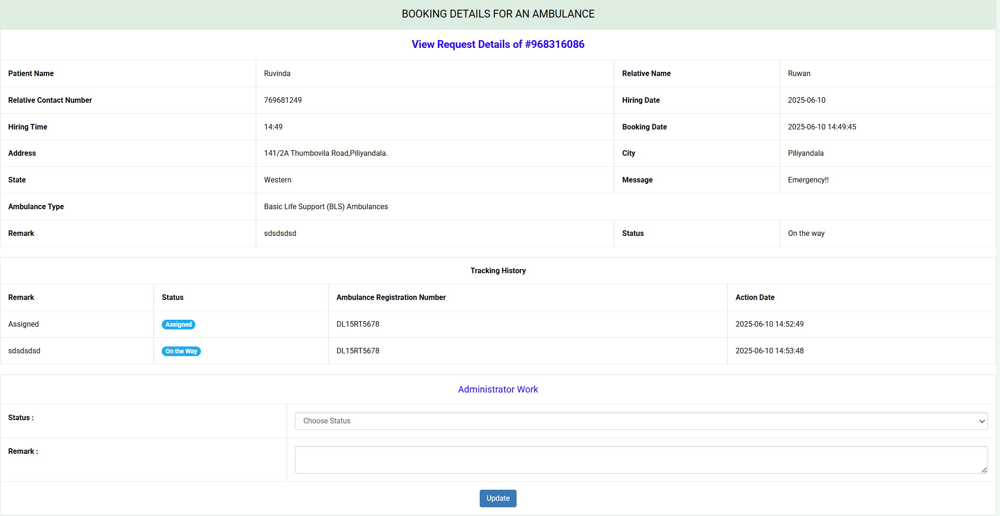
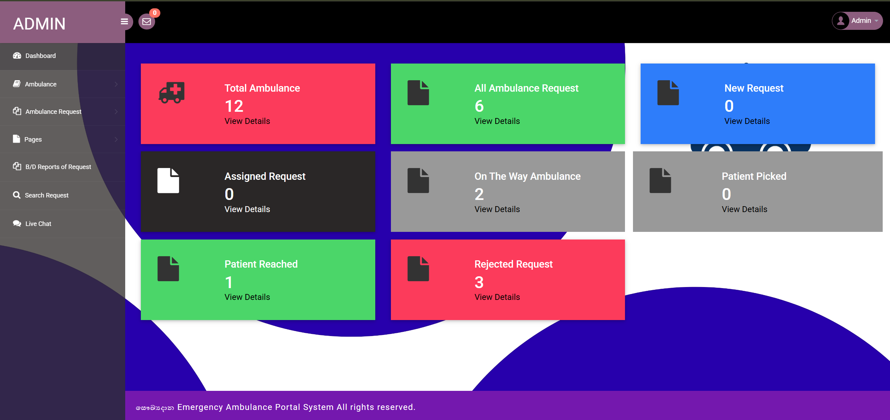
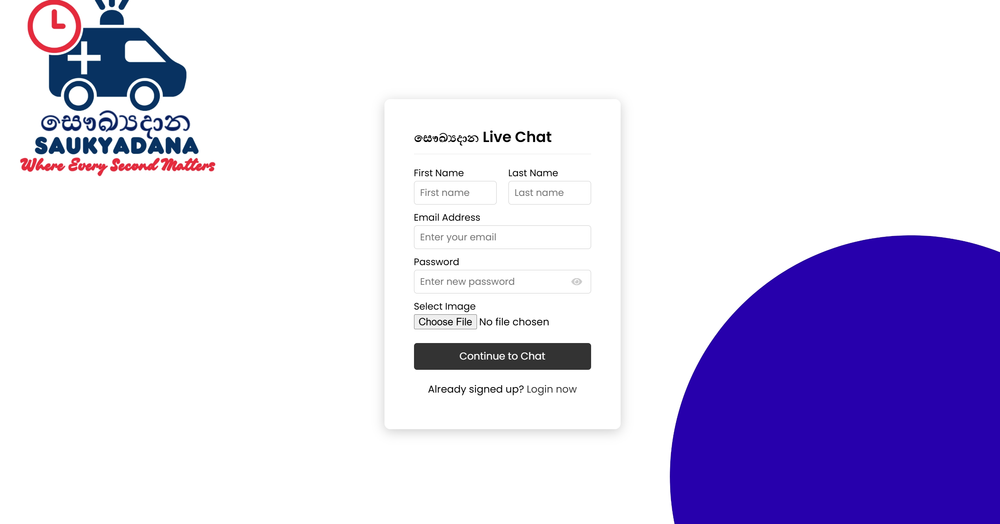
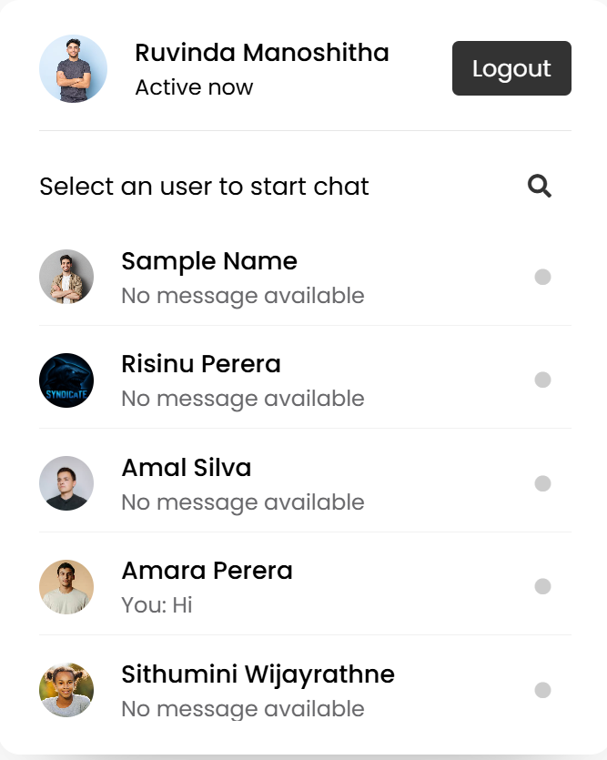
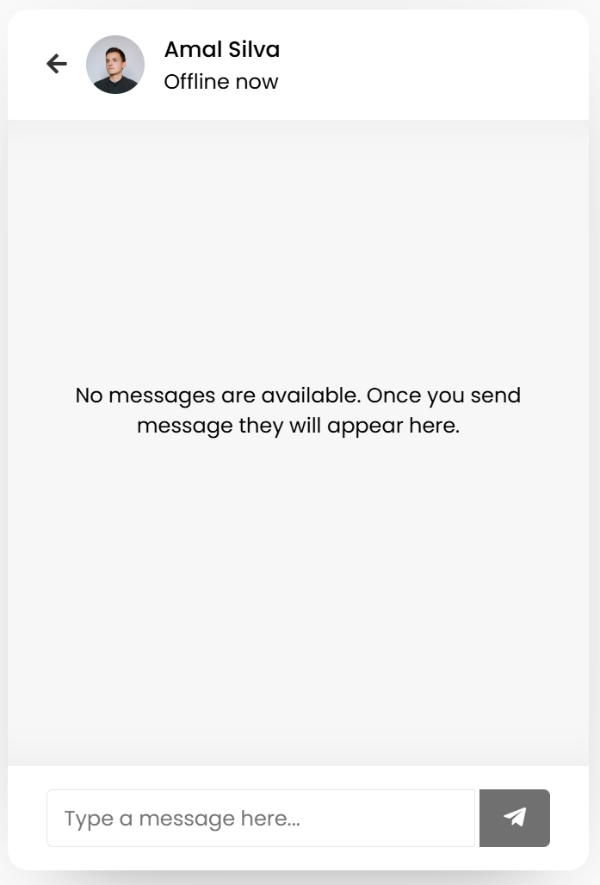
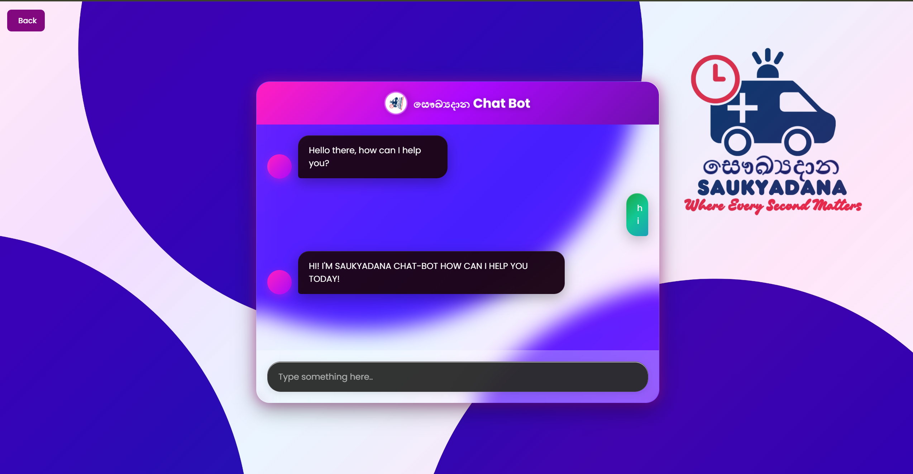

# 🩺 සෞඛ්‍යදාන (SAUKYADANA) — Web-Based Advance Emergency Ambulance Hiring Portal

<p align="center">
  
</p>

A **web-based emergency ambulance hiring portal** designed to provide **fast, secure, and user-friendly access** to ambulance services in Sri Lanka.  
SAUKYADANA allows users to **book ambulances without registration**, track the request, and communicate efficiently with service providers via **live chat** and a **chatbot**.

---

## 🚀 Features

- **Emergency Booking Without Account** — Request an ambulance using **ID, phone number, or name**  
- **Request Tracking** — Follow the booking progress (assigned / on the way / patient picked / reached)  
- **Live Chat & Chatbot** — Instant assistance and automated FAQs  
- **Admin Dashboard** — Manage bookings, track statuses, generate reports  
- **Security & Privacy** — Sensitive data handled securely  
- **Responsive UI** — Works on **desktop, tablet, and mobile**

---

## 🧰 Tech Stack

| Frontend | Backend | Database | Comms/Other |
|---|---|---|---|
| HTML5, CSS3, JavaScript, Bootstrap/Tailwind | PHP | MySQL | Live Chat, Email Gateway, SLF4J Logging |

---

## 📦 Project Structure
SAUKYADANA/
├─ admin/ # Admin panel (dashboard, requests, reports)
├─ assets/ # CSS/JS/images used by pages
├─ CHAT BOT/ # Chatbot UI/assets
├─ databases/ # SQL dumps / migrations (import to MySQL)
├─ includes/ # PHP includes/config/DB connection helpers
├─ LIVE CHAT/ # Realtime chat module
├─ Project-Materials/ # Branding (logo, etc.)
├─ ui/ # Screenshots used in README
├─ ambulance-tracking.php
├─ booking-details.php
├─ index.php
└─ README.md


---

## 🖼️ User Interfaces (Screenshots)

> All screenshots are stored in `ui/`.

### 🏠 Home & Hiring

| Home 01 | Home 02 |
|---|---|
|  |  |

| Hire an Ambulance |
|---|
|  |

### 📍 Tracking & Details

| Tracking Search | Booking Details |
|---|---|
|  |  |

### 📊 Admin Dashboard

| Dashboard |
|---|
|  |

### 💬 Communication (Chat + Bot)

| Live Chat – Signup | Chatbox (User List) |
|---|---|
|  |  |

| Chat View | Chatbot |
|---|---|
|  |  |

---

## 🧭 System Architecture
---

## ⬇️ Clone the Repository

```bash
git clone https://github.com/Ruvi7599/Web-based-Emergency-Ambulance-Hiring-Portal.git
cd Web-based-Emergency-Ambulance-Hiring-Portal
⚙️ Setup & Installation (XAMPP on Windows)

Install XAMPP and start Apache + MySQL.

Copy the project folder into:

C:\xampp\htdocs\PROJECT\SAUKYADANA


Or just place it under htdocs directly:

C:\xampp\htdocs\Web-based-Emergency-Ambulance-Hiring-Portal


Create MySQL Database

Go to: http://localhost/phpmyadmin

Create a DB, e.g. saukyadana

Import SQL file(s) from: databases/ (e.g., saukyadana.sql)

Configure DB Connection

Open includes/ (e.g., db_connect.php)

Update credentials:

$host = "localhost";
$db   = "saukyadana";
$user = "root";
$pass = ""; // default XAMPP


Run the project

If placed at C:\xampp\htdocs\SAUKYADANA:

http://localhost/SAUKYADANA


If using PROJECT/SAUKYADANA:

http://localhost/PROJECT/SAUKYADANA


Admin Panel

Visit: http://localhost/PROJECT/SAUKYADANA/admin (or your path)

Default credentials: (set these in your SQL import or admin table)
